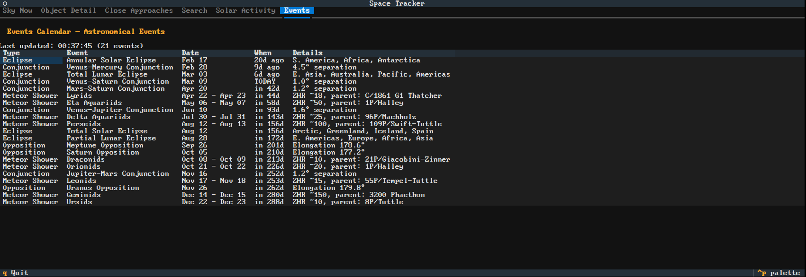

# Space Tracker

A terminal UI for amateur astronomers to track planets, asteroids, the Sun, Moon, and other celestial objects — all from the comfort of your terminal.

Built with [Textual](https://github.com/Textualize/textual) and powered by NASA/JPL APIs.



## Features

- **Sky Now** — see what's currently visible from your location with altitude, azimuth, and magnitude
- **Object Detail** — drill into any object for rise/set times, distance, RA/Dec, and elongation
- **Close Approaches** — upcoming asteroid flybys with size, distance, and velocity
- **Search** — look up any solar system object by name or designation
- **Solar Activity** — solar flares, CMEs, and geomagnetic storms from NASA DONKI
- **Events Calendar** — conjunctions, oppositions, meteor showers, and eclipses

## Requirements

- Python 3.12+
- [uv](https://github.com/astral-sh/uv) package manager

## Installation

```bash
git clone https://github.com/your-username/space-tracker.git
cd space-tracker
uv sync
```

## Usage

```bash
uv run space-tracker
```

On first launch you'll be prompted to set your observation location (latitude, longitude, elevation). This is saved to `~/.config/space-tracker/` and can be changed later.

### Keybindings

| Key   | Action              |
| ----- | ------------------- |
| `Tab` | Switch between tabs |
| `q`   | Quit                |

## Development

```bash
uv sync --dev          # Install dev dependencies
uv run pytest -v       # Run tests
```

## Data Sources

- [JPL Horizons API](https://ssd.jpl.nasa.gov/horizons/) — ephemeris data for all solar system objects
- [JPL SBDB Close Approach API](https://ssd-api.jpl.nasa.gov/doc/cad.html) — asteroid close approach data
- [NASA DONKI API](https://api.nasa.gov/) — space weather and solar activity

## License

MIT
